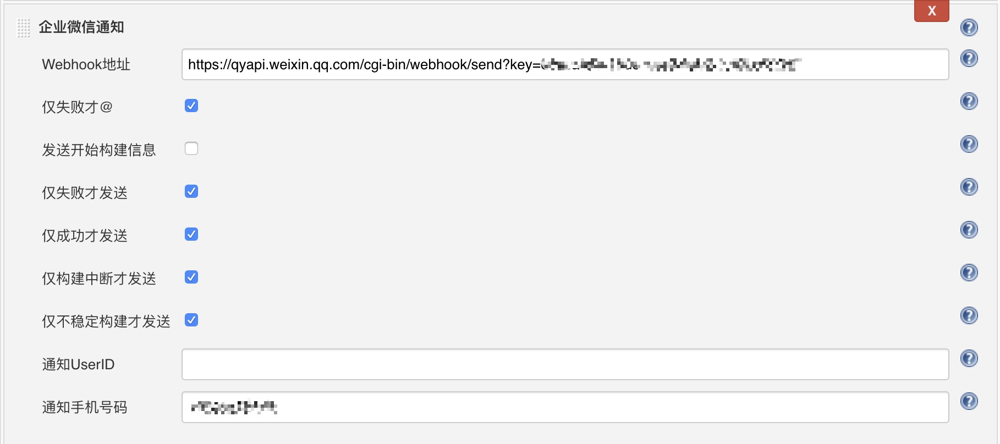

# 企业微信Jenkins构建通知插件

[](https://ci.jenkins.io/job/Plugins/job/qy-wechat-notification-plugin/job/master/)
[](https://plugins.jenkins.io/qy-wechat-notification)

> 该插件适用于使用"企业微信"工作的小伙伴，在Jenkins项目构建时使用群机器人进行状态通知
>
> 需要不低于企业微信 2.8.7版本

## 添加群机器人

任意群成员，都可以通过`右键`群名称的进行添加群机器人


企业微信会给新增加的群机器人分配一个Webhook，作为通知接口


## 项目配置

在Jenkins项目底部的`构建后操作`，添加`企业微信通知配置`


将Webhook地址信息输入Jenkins中，即可完成最简单配置


可配置的控制项（可多选）：
- 是否仅失败才发送信息
- 是否仅成功才发送信息
- 是否仅中断才发送信息
- 是否仅不稳定构建才发送信息
- 是否仅失败才@
- 是否发送开始构建信息

## 运行效果

在构建开始的时候，群机器人会执行开始构建通知 (需勾选"发送开始构建信息")


构建成功后，群机器人会执行构建成功的通知 (需勾选"仅成功才发送信息")


构建失败时，群机器人则会执行失败的通知 (需勾选"仅失败才发送信息")


## 项目开发
```
mvn org.jenkins-ci.tools:maven-hpi-plugin:run
```

打开Jenkins地址
```
http://127.0.0.1:8080/jenkins
```

项目DEBUG
````
set MAVEN_OPTS=-Xdebug -Xrunjdwp:transport=dt_socket,server=y,address=8000,suspend=n
````

项目打包
````
mvn package
````
